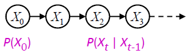

# 一、搜索问题

搜索问题包含：

- **状态空间**：所有情况的集合
- **继承函数**：不同集合转换所需要的操作和花费
- **起始状态**
- **目标状态**

**搜索问题的解**是一系列的能将起始状态变成目标状态的操作

**状态空间图**：将结点作为状态空间的不同情况，箭头用来表示继承

Note：在状态空间图中，每个状态只会出现一次

## 搜索树

起始状态是树的根结点，结点的后代是该状态的继承状态

Note：对于大多数问题，我们无法构建出整个树

重要概念：

- **Fringe**(frontier)：一个有序列表，存放所有将要访问的结点
- **Expansion**：一个无序列表，存放所有访问过的结点
- **搜索策略**：决定搜索的算法

```pseudocode
# 伪代码
function TREE-SEARCH(problem, strategy) returns a solution, or failure
	initialize the search tree using the initial state of problem
	loop do:
		if there are no candidates for expansion then return failure
		choose a leaf node for expansion according to strategy
		if the node contains a goal state then return the corresponding solution
		else expand the node and add the resulting nodes to the search tree
	end
```

## 非启发式搜索策略

### 深度搜索DFS

- ​	策略：扩展到最深的一层
- ​	实现：Fringe是一个LIFO的栈
- ​	扩展方式：从左到右、可以处理整个树、最差情况要遍历整个树
- ​	Fringe的空间：取从根到底部一条路径上的结点，与之相连的所有结点
- ​	是否完备：如果有环，则不完备
- ​	是否最优：否，只能找到最左边的解，而无关深度和花费

### 广度搜索BFS

- 策略：扩展最浅的一层
- 实现：Fringe是一个FIFO的队列
- 扩展方式：一层层扩展，可以处理整个树，要遍历到有解的一层
- Fringe的空间：每层的长度
- 是否完备：是（如果有解存在，则一定能找到）
- 是否最优：当且仅当所有花费为相同值的时候最优

### 统一代价搜索UCS

- 策略：扩展花费最少的结点
- 实现：Fringe是一个优先队列
- 扩展方式：记录当前走到该结点花费和其子节点花费和，取最小花费
- Fringe的空间：和解路径长度有关
- 是否完备：是
- 是否最优：是
- UCS的问题：会搜索所有的方向，且没有任何关于结果位置的信息

## 启发式搜索策略

**启发式 heuristic**：对当前状态到目标状态花费的估计，通常用h表示

Note：启发式通常对特定问题能够有帮助，如曼哈顿距离、欧拉距离。若当前状态为目标状态，则$h(goal)=0$

### 贪心搜索

- 策略：扩展认为离目标状态最近的点

### A*搜索

**与UCS和贪心的比较**：UCS只考虑实际的路径花费，贪心只考虑预测的花费，A*考虑当前实际和未来预测的和花费

- 策略：扩展到该点路径和其路径启发和最小的结点

重要概念：

1. **可接受启发 Admissible Heuristics**：

   定义$h$为可接受的当且仅当
   $$
   0\leq h(n)\leq h^*(n)
   $$
   其中$h^*(n)$是该点到最近目标的真实花费

2. **一致的启发 Consistent Heuristics**：

​		定义任意点A，其子结点为B，则其具有一致性当且仅当
$$
h(A)-h(C)\leq cost(A\_to\_C)
$$
​		其中$h(A)$为$A$点到目标点的预测距离，$cost$为实际距离

Note：如果一个启发具有一致性，则其一定是可接受的

**A*搜索的必要条件**：

- 如果是**树搜索**，则启发必须是**可接受启发**
- 如果是**图搜索**，则启发必须是**一致的启发**

# 二、CSP问题

CSP全称Constraint Satisfaction Problems，意为约束满足问题

特征：

- 满足目标比找到路径更重要
- 路径花费相同或深度相同
- 继承函数是给未分配的值分配值
- 状态是被一个变量定义的，该变量是某一域的元素
- 目标测试是一组约束条件，规定了变量子集的可允许的数值组合

## 举例：地图上色问题

- 变量：地图上的地名
- 域：几种颜色
- 限制：地图上相邻地区不能涂相同颜色（隐式表达：$A\neq B$；显示表达：$(A,B)\in \{(color1, color2), (color1,color3),...\}$）
- 解：满足所有限制的分配

## 回溯搜索

回溯搜索时解决CSP问题的最基本方法

**策略**：考虑当前结点的值，使其不与之前分配过的结点值冲突；需要测试已分配的结点是否满足限制；逐步达到目标；使用类似DFS的理念

**Backtracking = DFS + variable-ordering + fail-on-violation**

Note：[演示网站](https://inst.eecs.berkeley.edu/~cs188/fa19/assets/demos/csp/csp_demos.html)

```pseudocode
# 伪代码
function BACKTRACKING-SEARCH(csp) returns solution/failure
	return RECURSIVE-BACKTRACKING({},csp)
function RECURSIVE-BACKTRACKING(assignment,csp) returns solution/failure
	if assignment is complete then return assignment
	var <- SELECT-UNASSIGNED-VARIABLE(VARIABLES[csp],assignment,csp)
	for each value in ORDER-DOMAIN-VALUES(var,assignment,csp) do
		if value is consistent with assignment given CONSTRAINTS[csp] then
			add{var = value} to assignment
			result <- RECURSIVE-BACKTRACKING(assignment,csp)
			if result != failure then return result
			remove{var = value} from assignment
	return failure
```

## 回溯搜索的优化

### 提升一、前向检查 Forward Checking

- 筛选：追踪未分配变量的域，并划掉其无法被分配的值
- 前向检查：当值被分配到当前结点，对其它结点进行筛选过后，如果有任何结点变量没有能分配的值，直接进行回溯

### 提升二、弧相容性 Arc Consistency

有时虽然未分配的结点有能够被分配的值，但由于另一个未分配的结点取值后，该结点会没有任何能分配的值，我们需要预测这样的失败

**相容性**：

​		我们定义$arc\, X\rightarrow Y$是具有一致性的当且仅当对于任意一个$X$能取的值$x$，$Y$中都有一个值能够分配且不和约束条件冲突

- 弧相容性判断：在每次分配过后，对所有未分配、相互影响的结点判断弧是否相容

```pseudocode
function AC-3(csp) returns the CSP, possibly with reduced domains
	inputs:csp, a binary CSP with variables{X1, X2, ..., Xn}
	local variables:queue, a queue of arcs, initially all the arcs in csp
	
	while queue is not empty do
		(Xi, Xj) <- REMOVE-FIRST(queue)
		if REMOVE-INCONSISTENT-VALUES(Xi, Xj) then
			for each Xk in NEIGHBORS[Xi] do
				add(Xk, Xi) to queue
function REMOVE-INCONSISTENT-VALUES(Xi, Xj) returns true iff succeeds
	removed <- false
	for each x in DOMAIN[Xi] do
		if no value y in DOMAIN[Xj] allows (x, y) to satisfy the constraint Xi <-> Xj
			then delete x from DOMAIN[Xi]
			removed <- true
	return removed
```

## K-Consistency

- 1-Consistency (Node Consistency)：每个单独结点满足了自己域与限制条件
- 2-Consistency (Arc Consistency)：对每一对结点，对其中任意一个满足一致性的分配能使另一个结点也有值满足约束
- k-Consistency：对每$k$个结点，任意一个满足一致性的对$k-1$结点的分配能使第$k$个结点也有值满足约束

Note：对于越高的$k$，计算复杂度越大

### 强K-Consistency

对于强$K$一致性，则其有$K,K-1,K-2,...,1$一致性

## 顺序 Ordering

### 最小剩余值 MRV

- 策略：未知下一个要分配的结点，选择剩余域最小的结点来分配

### 最小约束值 LCV

- 策略：已知下一个要分配的结点，选择影响其它结点取值最小的值分配（使剩余结点域尽可能大）

## 结构 Structure

### 独立结构

**定义**：两个没有任何连结的图、相互没有任何影响、关联的结点被称作相互独立，如图中的$T$和其它结点


### 树状结构

**定义**：没有成环的连通图

**定理**：如果一个限制图没有成环，那么该CSP问题可以在$O(nd^2)$的时间内解决

而对于通常的CSP问题，最差时间是$O(d^n)$

**解决算法**：

1. **排序**：选择一个根变量，对变量进行排序，使其父辈先于子辈

   

2. **从后删除**：从最后一个结点开始，如果父节点存在弧不相容的分配，将该值删去

3. **从前分配**：从第一个结点开始，选择任意不和子节点冲突的剩余值

**特征**：

1. 从后删除以后，所有的根指向叶的弧都是相容的
2. 如果所有根指向叶的弧是相容的，那么从前分配就不会回溯

### 类似树状结构——割集 Cutset

定义：割集是一个能使剩下限制图称为树的集合


割集条件：实例化割集并解决剩下的树状CSP

Note：寻找割集是一个$NP-hard$问题

## 迭代算法

策略：

- 对所有值进行分配，取出没有满足约束的赋值
- 重新赋值获得最少的冲突

表现：


### 局部搜索

策略：不停地提升单独选择直到不能再优化

#### 爬山法

策略：往相邻的更高结点移动，如果没有更高的相邻结点，退出并返回当前最优

问题：导致局部最优而非全局最优

### 束搜索

策略：在DFS的同时，子节点启发式优先排序，保留$k$个（$k$定义为beam size）结点继续搜索。

Note：当$k=1$时，该算法为贪心算法；当$k\rightarrow+\infty$时，该算法为BFS

### 模拟退火（爬山问题）

策略：通过允许下坡来规避局部最优值

1. 选择一个随机的移动
2. 总是接受向上的移动
3. 以$e^{-\frac{\Delta E}{T}}$的概率接受向下的移动
4. 随着时间使$T$下降来降低接受向下移动的概率

定理：如果$T$下降得足够慢，我们将得到最优解

### 遗传算法（八皇后问题）


其中每个数字代表该列的皇后的位置，在Fitness过程中，红色数字代表任取两两皇后不冲突的数量（一共有八个皇后，因此数量最多为$C_2^8=28$）。适应性百分比和不冲突数量成正比，决定了选择哪些父结点的概率（如图，第一个父节点选了一次，第二个选了两次，第三个选了一次），然后两两配对。随机找一个杂交点进行互换。最后在生成的子节点中每个位置都会按照某个小的独立概率随机变异。

# 三、对抗搜索

游戏的种类：

- 确定还是随机？
- 玩家个数
- 零和游戏？（玩家有对立的目标，竞争关系）
- 可观测的状态信息数

## 确定博弈

相比于单人游戏树，对抗游戏树代理和对手交替进行，且双方都走最优情况

### 极小极大算法

策略：代理选择价值最大的下一步状态；对手选择使代理价值最小的下一步状态

实现：递归遍历直至叶节点，将子节点值回传

```pseudocode
def VALUE(state):
	if the state ia a terminal state: return the state's utility
	if the next agent is MAX: return MAX-VALUE(state)
	if the next agent is MIN: return MIN-VALUE(state)
	
def MAX-VALUE(state):
initialize v = -infinity
for each successor of state:
	v = max(v, VALUE(successor))
return v

def MIN-VALUE(state):
initialize v = +infinity
for each successor of state:
	v = min(v, VALUE(successor))
return v
```

效率：和DFS相同

限制和改进：在真实世界中，无法递归到根节点，因此有**深度限制搜索**，只会搜索到树中一个限制的深度，且将终点的确定状态换成非终点的**评估方程（Evaluation Function）**

### 评估方程 Evaluation Function

评估方程给出了非终点结点的价值分数

理想状况：返回当前位置的实际极小极大值

通常取值为某些特征的加权平均：$Eval(s)=w_1f_1(s)+w_2f_2(s)+...+w_nf_n(s)$

其它取值：

- 蒙特卡洛树搜索：多次随机选择移动直到游戏结束，比较各种移动的获胜率
- 卷积神经网络：从一直的游戏记录预测状态的价值分数

### 游戏树的修剪 Pruning

#### Alpha-Beta 修剪


如果$n$有子结点的值比$a$小，我们可以停止计算$n$的其它子结点，因为$a$的父节点不会取$n$

Note：**倒三角为取最小值，正三角为取最大值**

```pseudocode
# a: MAX's best option on path to root
# b: MIN's best option on path to root

def MAX-VALUE(state, a, b):
initialize v = -infinity
for each successor of state:
	v = max(v, VALUE(successor, a, b))
	if v >= b return v
	a = max(a, v)
return v

def MIN-VALUE(state, a, b):
initialize v = +infinity
for each successor of state:
	v = min(v, VALUE(successor,a,b))
	if v <= a return v
	b = min(b, v)
return v
```

Note：子结点的良好顺序将会提升修剪的效率，在最好的情况下，时间复杂度为$O(b^\frac{m}{2})$（$b$为父结点的子结点数，$m$为深度）

## 随机博弈

对抗游戏树代理和对手交替进行，但对手以一定概率行动

### 期望最大搜索

策略：

- 计算最佳路径下的平均分值
- 最大值结点和极大极小算法一样
- 概率结点是不确定的，需要子结点的权重和（**马尔可夫决策过程**）

Note：概率结点用圆形表示

# 四、逻辑 AI

## 推理逻辑

**知识库 Knowledge base**：一个用来表达真实世界，以**正式语言**呈现的**命题集合**

**推理 Inference Engine**：根据知识库对任何可解决的问题的**解答**

**正式语言 Formal Language**：逻辑中的形式语言的组成部分，包含

- 语法 Syntax：命题的语法合规性。eg. $x+y\geq y$ 是命题；$x2+y>\{\}$ 不是命题
- 语义 Semantics：命题的对错。eg. $x+2\geq y$ 是正确的当$x=7,y=1$；是错误的当$x=0,y=6$

规则：

- 诸如$P1,P2$的逻辑符号是命题
- 取反：如果$S$是命题，$\neg S$是命题
- 合取：如果$S1$和$S2$是命题，$S1\wedge S2$是命题
- 析取：如果$S1$和$S2$是命题，$S1\vee S2$是命题
- 条件：如果$S1$和$S2$是命题，$S1\Rightarrow S2$是命题
- 双向蕴含：如果$S1$和$S2$是命题，$S1\Leftrightarrow S2$是命题


**维恩图 Venn Diagrams**：


**逻辑等价**：


### 有效性和可满足性

- **有效性**的命题：在任何情况都是正确的命题。eg. $A\vee\neg A$

- **可满足**的命题：存在条件使命题是正确的
- **不可满足**的命题：不存在条件使得命题是正确的

### 蕴含 Entailment

$\alpha |=\beta$表明在一个域中，如果$\alpha$是正确的，那么$\beta$也是正确的

Note：这意味着$\alpha-world$是$\beta-world$的子集

### 证明

证明（$\alpha |-\beta$）是一种从$\alpha$到$\beta$蕴含的表示

方法：

1. 模型检测：通过真值表来检查$models(\alpha)\subseteq models(\beta)$，时间复杂度是n的指数
2. 推理法则的应用：寻找一个有限的命题序列，其中每个命题都是一个**公理**、或是按照公理规则推导的命题

Note：**公理**：已知为真的命题；**推理规则**：一个输入为命题且返回一个命题的函数

### 良好性和完整性

- 良好行 Soundness：一切可以证明的事情事实上都是必然的
- 完整性 Completeness：所有被包含的东西都可以证明

### 合取范式 CNF Conjunctive Normal Form

定义：以子句合取式$\wedge$表达的语句

Note：需要将通常逻辑语句进行转换，以$B_{1,1}\Leftrightarrow(P_{1,2}\vee P_{2,1})$为例

- Step1：消去等价词$\Leftrightarrow$，用$(\alpha \Rightarrow\beta)\wedge (\beta \Rightarrow \alpha)$取代$(\alpha \Leftrightarrow \beta)$
  $$
  (B_{1,1}\Rightarrow(P_{1,2}\vee P_{2,1}))\wedge ((P_{1,2}\vee P_{2,1})\Rightarrow B_{1,1})
  $$

- Step2：消去条件词$\Rightarrow$，用$\neg\alpha\vee\beta$取代$\alpha\Rightarrow\beta$
  $$
  (\neg B_{1,1}\vee P_{1,2}\vee P_{2,1})\wedge (\neg(P_{1,2}\vee P_{2,1})\vee B_{1,1})
  $$

- Step3：CNF要求否定词只能出现在文字前边，因此我们需要将否定词内移
  $$
  (\neg B_{1,1}\vee P_{1,2}\vee P_{2,1})\wedge ((\neg P_{1,2}\wedge \neg P_{2,1})\vee B_{1,1})
  $$

- Step4：使用分配律
  $$
  (\neg B_{1,1}\vee P_{1,2}\vee P_{2,1})\wedge (\neg P_{1,2}\vee B_{1,1})\wedge(\neg P_{2,1}\vee B_{1,1})
  $$

### 归结算法 Resolution

归结算法用于证明蕴含关系：$\alpha |=\beta$，如果该条件成立，那么$\alpha \wedge \neg \beta$是不可满足的

1. 将$\alpha \wedge \neg \beta$转换为CNF形式

2. 以$\wedge$分割成小语句，不断对任意两个小语句进行**归结**，直到以下两件事之一发生：

   a) 两个小语句析取出一个空语句，则原命题成立

   b) 没有任何生成的语句是空的，且无法再添加新语句，则原命题是错误的

如图，证明$KB|=\alpha$


**归结**：已知$l_i$与$m_j$互补（一个为另一个的$\neg$），存在子句$A:l_1\vee l_2\vee ...\vee l_k, B:m_1\vee m_2\vee ...\vee m_k$，归结选取两个子句(A和B)，并生成一个新的子句，该新子句包含除两个互补文字以外的原始子句中的所有文字
$$
\frac{l_1\vee l_2\vee ...\vee l_k,\quad m_1\vee m_2\vee ...\vee m_k}{l_1\vee ...\vee l_{i-1}\vee l_{i+1}\vee ...\vee l_k\vee m_1\vee ...\vee m_{j-1}\vee l_{j+1}\vee ...\vee j_k}
$$

### Horn子句和限定子句

**限定子句定义**：恰好只含有一个正文字的析取式

**Horn子句定义**：至多只含有一个正文字的析取式

Note: **所有限定子句都是Horn子句**

特征：

- 所有Horn子句都可以写成蕴含式，更易于理解，eg.$(\neg A\vee\neg B\vee C)$可以写成$(A\wedge B)\Rightarrow C$
- 使用Horn子句的推理可以使用**前向链接**和**反向链接**算法，这些类型的推理构成了**逻辑程序设计**
- 用Horn子句判定蕴涵需要的时间与知识库大小呈线性关系

#### 前向链接 Forward chaining

符号：$PL-FC-ENTAILS?(KB,q)$

作用：查询单个命题词$q$是否被限定子句的知识库所蕴含

策略：从知识库中已知的事实出发，如果蕴含式的所有前提已知，那么就把它的结论添加到已知事实集中。这个过程持续进行，直到查询$q$被添加或无法进行更进一步的推理。


#### 反向链接 Backward chaining

作用：查询单个命题词$q$是否被限定子句的知识库所蕴含

策略：从结论$q$倒推——用$BC$来证明$q$，检查$q$是否已经直到是真的或者通过$BC$证明一些规则的前提，得出$q$的结论

避免循环：检查新的子目标是否已经在目标栈上

避免重复工作：

- 检查新的子目标是否已经被证明是正确的
- 检查新的子目标是否已经被证明是错误的

#### 前向链接和反向链接的比较

- 前向链接是**数据**驱动的，自动、无意识地处理，可能会做和目标不相关的证明
- 反向链接是**目标**驱动的，适合解决问题，复杂度比知识库大小的线性相关要小很多

# 五、一阶逻辑

推理逻辑的优点：

- 命题逻辑允许部分、非结合、否定的信息（不像大多数据结构和数据库）
- 命题逻辑是组合式的（$B_{1,1}\wedge P_{1,2}$的意义是由$B_{1,1}$和$P_{1,2}$意义组合而成的）
- 命题逻辑中的意义是和上下文无关的（自然语言的意义依赖于上下文）

推理逻辑的缺点：

- 难以识别个体
- 不能直接谈论个体的属性或个体之间的关系（*我很高*）
- 概括性、模式、规律性不容易表示（*所有三角形都有三条边*）

## 一阶逻辑的组成部分

- 对象：人们、房子、数字、理论、战争...
- 关系：可以是一元关系或称**属性**，诸如：红色的、圆的...；也可以是$n$元关系，诸如：比...大、在...的里面
- 函数：...的父亲、...的开始

Note: 也称为一阶谓词逻辑

**命题逻辑和一阶逻辑最根本的区别**：每种语言所给出的[本体论约定](https://zh.m.wikipedia.org/zh-hans/%E6%9C%AC%E4%BD%93_(%E4%BF%A1%E6%81%AF%E7%A7%91%E5%AD%A6))，即关于现实本质的假设不同


## 一阶逻辑的基础元素

### 符号

- 逻辑符号
  - 连结：$\neg, \vee, \wedge,\Rightarrow,\Leftarrow$
  - 量词：$\forall, \exists$
  - 变量：$x,y,a,b,...$
  - 相等：$=$
- 非逻辑符号
  - 常量：$KingArthur, 2, Shanghaitech,...$
  - 谓语：$Brother, >,...$
  - 函数：$Sqrt, LeftLegOf,...$

### 原子语句 Atomic sentence

定义：对象和谓词组合的用来称述事实的语句

构成：原子语句由谓词符号以及随后被括号括起来的**列表项**组成

举例：

- $Brother(Richard,John)，Richard=John$

### 项 Term

定义：代指对象的逻辑表达式

构成：常量、变量或是函数

### 复合语句 Complex sentence

定义：用逻辑连接词连结的原子语句

举例：

- $Sibling(KingJohn,Richard)\Rightarrow Sibling(Richard,KingJohn)$
- $>(1,2)\vee \leq (1,2)$

### 量词 Quantifiers

量词允许我们表达对象集合的属性，而不是通过名称来列举对象

#### 全称量词 $\forall$

格式：
$$
\forall<variables><sentence>
$$
含义：$\forall x\ P$是在模型$m$中为真的当且仅当对于每个模型中$x$的可能对象，$P$都为真

举例：

- $\forall x\ At(x,STU)\Rightarrow Smart(x)$：所有在STU的人都是聪明的

Note: 

- 全程量词和所有$x$对象的合取是等价的
- 通常情况下，$\forall$主要和$\Rightarrow$连用
- 常见错误：用$\wedge$作为和$\forall$的连用词
  - $\forall x\ At(x,STU)\wedge Smart(x)$：所有人都在STU且所有人都是聪明的

#### 存在量词 $\exists$

格式：
$$
\exists<variables><sentence>
$$
含义：$\exists x\ P$是在模型$m$中为真的当且仅当对于一些模型中$x$的可能对象，$P$都为真

举例：

- $\exists x\ At(x,STU)\wedge Smart(x)$：一些在STU的人是聪明的

Note:

- 存在量词和所有$x$对象的析取是等价的
- 通常情况下，$\exists$主要和$\wedge$连用
- 常见错误：用$\Rightarrow$作为和$\exists$的连用词
  - $\exists x\ At(x,STU)\Rightarrow Smart(x)$是正确的当有人不在STU

#### 嵌套量词

- $\forall x\ \forall y$ 和 $\forall y\ \forall x$ 等价
- $\exists x\ \exists y$ 和 $\exists y\ \exists x$ 等价
- $\exists x\ \forall y$ 和 $\forall y\ \exists x$ 不等价
  - $\exists x\ \forall y \ Loves(x,y)$：存在一个人，他爱全世界所有的人
  - $\forall y \ \exists x\  Loves(x,y)$：全世界任意一个人都至少会被一个人爱
- 量词等价：可以互相表示的量词形式
  - $\forall x \ Likes(x,IceCream) \equiv \neg\exists x\ \neg Likes(x,IceCream)$
  - $\exists x \ Likes(x,Broccoli) \equiv \neg\forall x\ \neg Likes(x,Broccoli)$

### 等词

格式
$$
term_1=term_2
$$
含义：该等词是正确的当且仅当$term_1$和$term_2$代指同一个对象

## 一阶逻辑的语义

句子对于一个模型来说是真的，这个模型要包含

- 对象和对象之间的关系
- 解释说明代指
  - 常量$\rightarrow$对象
  - 谓词$\rightarrow$关系
  - 函数符号$\rightarrow$函数关系

一个原子语句$predicate(term_1,...,term_n)$是真的当且仅当对象$term_1,...,term_n$具有谓词代指的关系

Note: 

- 一阶逻辑有无数种组合
- 只有在具体模型下，逻辑语句本身才有意义

## 变量语句

- 如果一个变量没有被量词限定，那么这个变量是自由的
  - $\forall x\ P(x,y)$
- 如果一个变量有量词的，那么这个变量是被限定的
  - $\forall x\  \exists y\ P(x,y)$

Note: 在一阶逻辑中，所有的变量必须被限定

## 一阶逻辑中的推理

### 全称量词实例化 UI

规则：可以得出任何用**基项**（没有变量的项）置换变量得到的语句

设$SUBST(\theta,\alpha)$表示把置换$\theta$应用于$\alpha$，那么规则可以写为
$$
\frac{\forall v\quad \alpha}{SUBST(\{v/g\},\alpha)}
$$
其中，$v$为变元，$g$为基项（具体变量），如$\{x/John\}$指用$John$来替换变量$x$

Note: UI 可以被调用**多次**来增加新的句子

举例：

- $\forall x\ King(x)\wedge Greedy(x)\Rightarrow Evil(x)$产生了$King(john)\wedge Greedy(John)\Rightarrow Evil(John)$

### 存在量词实例化 EI

规则：用一个新的常量符号替代变元

**如果$k$没有在知识库的任何地方出现**，那么规则可以写为
$$
\frac{\exists v\quad \alpha}{SUBST(\{v/k\},\alpha)}
$$
Note: 

- EI 可以被调用**一次**来代替存在的句子
- 存在量词实例化一般过程称为 **Skolem 化**

举例:

- $\exists x\ Crown(x)\wedge OnHead(x,John)$可以写成$Crown(C_1)\wedge OnHead(C_1,John)$，其中$C_1$是一个新的常量符号，叫做**Skolem 常数**

### 退化到命题推理

策略：对于一个数据库中的所有命题，将全称量化语句用所有的实例化来替代，产生的新的数据库被称为**命题化**的

Note: 每一个一阶逻辑的数据库都可以被命题化，且同时**保留蕴含**（如果能在原先的数据库蕴含的基项在新的数据库也能被蕴含）

产生问题：

- 通过方程符号，能够生成无限个基项，$Father(Father(Father(John)))$
- 会生成很多不相关的命题

#### Herbrand 理论

- 如果一个命题$\alpha$被一个一阶逻辑数据库所蕴含，它也被一个有限的命题化的数据库的子集蕴含

想法：

对于$n=0\rightarrow+\infty$

1. 创造一个命题化的数据库，命题化深度为$n$
2. 如果$\alpha$被该数据库所蕴含，则返回真

产生问题；

- 如果$\alpha$是蕴含的，则可以工作
- 如果$\alpha$不是被蕴含的，则将进入无限循环

#### Turing, Church 理论

- 一阶逻辑的蕴含问题是**半可判定**的
  - 存在算法能够证明蕴含成立的语句
  - 不存在算法否定蕴含不成立的语句

### 合一 Unification

想法：为蕴含语句中的变量和知识库中待匹配语句中的变量找到替换

**一般化假言推理规则 GMP**：对于原子语句$p_i,{p_i}^{'},q$，存在置换$\theta$使得对所有的$i$都有$SUBST(\theta,p_i^{'})=SUBST(\theta,p_i)$成立
$$
\frac{p_1^{'},p_2{'},...,p_n^{'},(p_1\wedge p_2\wedge...\wedge p_n\Rightarrow q)}{SUBST(\theta,q)}
$$
**合一算法**：要求找到是不同的逻辑表示变得相同的置换。合一算法$UNIFY$以两条语句为输入，如果合一置换存在则返回它们的合一置换：
$$
UNIFY(p,q)=\theta\quad,where\ SUBST(\theta,p)=SUBST(\theta,q)
$$
举例：

- $UNIFY(Knows(John,x),Knows(John,Jane))=\{x/Jane\}$
- $UNIFY(Knows(John,x),Knows(y,Mother(y)))=\{y/Jane,x/Mother(John)\}$
- $UNIFY(Knows(John,x),Knows(x,Elizabeth))=fail$

最后一个合一失败，因为$x$不能同时取$John$和$Elizabeth$。需要对这两个语句中的一个进行**标准化分离**，即对这些变量重新命名以避免名称冲突，就可以解决这个问题。

#### 最一般合一置换 MGU

对于每对可合一的表达式，存在唯一的最一般合一置换，不考虑变量取名情况它是唯一的（考虑$UNIFY(Knows(John,x),Knows(y,z))=\{y/John,x/z\}$），该表示更具有一般化

### 一阶逻辑的前向链接

策略：从已知事实出发，触发所有前提得到满足的规则，然后把这些规则的结论加入到已知事实中。重复该过程直到得到查询的结果或者没有新的事实加入。

Note: 重命名的已知事实不是“新”事实（两个语句除了变量名称以外其它部分都相同）


特征：

- 对于一阶Horn子句是可靠且完备的
- 前向链接在无迭代函数的一阶Horn子句中是有限次数的驯悍
- 但在一般情况下，前向链接不会终结，由于$\alpha$是不被蕴含的（**半可判定的**）

### 一阶逻辑的反向链接


特征：

- 反向链接是一种深度优先搜索算法，空间需求和证明规模呈线性关系
- 能过通过检查当前目标和堆栈中的每个目标，避免无限循环
- 通过缓存以前的结果来避免重复的子目标
- 被逻辑编程广泛使用

### 逻辑编程 Prolog

规定：单一命名假设要求每个Prolog常量和基项都指向特定的对象，而封闭世界假设要求被只有被知识库蕴涵的语句的真值才是真。Prolog中**不可能断言真值为假**的语句，这使得Prolog 的表达能力不如一阶逻辑，但也正是这点使得Prolog 更有效更简洁

举例：

- Prolog定义：$Course(CS,101),Course(CS,102)$
- FOL定义：$Course(d,n)\Leftrightarrow (d=CS\wedge n=101)\vee (d=CS\wedge n=102)$

### 归结

前提：与命题逻辑一样，一阶逻辑的归结也要求语句必须是**合取范式**

**转换成CNF** 的过程和命题逻辑类似，主要的不同在于一阶逻辑要消除量词
$$
\forall x[\forall y\ Animal(y)\Rightarrow Loves(x,y)]\Rightarrow[\exists y\ Loves(y,x)]
$$


**互补**：

- 如果一个命题文字是另一个命题文字的否定式，则这两个命题文字是互补的
- 如果一个一阶逻辑文字能和另一个一阶逻辑文字的否定式合一，则这两个一阶逻辑文字是互补的

**归结推理规则**：对于已经完成变量标准化没有共享变量的两个子句，如果包含**互补文字**则可对它们进行归结


其中$UNIFY(l_i,\neg m_j)=\theta$


# 六、基于统计的AI

## 不确定性

对于达成某个目标有很多不确定的因素，如牙痛可以是由于牙齿有洞、或是牙龈疾病、牙龈脓肿...无法使用逻辑处理将这些限制全部列出，由于

- 惰性：为了确保得到一个没有任何意外的规则，需要列出前提和结论的完整集合，这个工作量太大
- 理论的无知：对于该领域，医学科学还没有完整的理论
- 实践的无知：即使我们知道所有的规则，对于一个特定的病人我们也可能无法确定，因为并不是所有必要的测试都已经完成，有的测试根本无法进行

想法：**概率**提供了一种方法以概括由我们的惰性和无知产生的不确定性，由此解决限制问题

## 概率

**效用理论**：每个状态对一个Agent而言都有一定程度的有用性，即效用，而Agent会偏好那些效用更高的状态
$$
决策理论=概率理论+效用理论
$$
**决策理论思想**：一个Agent 是理性的，当且仅当它选择能产生最高期望效用的行动，这里的期望效用是行动的所有可能结果的平均

**期望效用最大化 MEU**：$a^*=argmax_a\sum_sP(s|a)U(s)$

**随机变量**：定义世界上某些不确定性的变量，例如

- $R$：是否下雨？
- $D$：去图书馆要步行多久？

Note:

- 用大写字母来表示随机变量
- 随机变量存在值域

概率的条件：

- $\forall x\ P(X=x)\geq 0$
- $\sum_xP(X=x)=1$

**联合分布**：对于同时满足一系列随机变量的概率分布

**事件$E$概率**：$P(E)=\sum_{(x_1,...,x_n)in E}P(x_1,...,x_n)$

**边际概率**：$P(X_1=x_1)=\sum_{x_2}P(X_1=x_1,X_2=x_2)$

**条件概率**：$P(a|b)=\frac{P(a,b)}{P(b)}$

**乘积法则**：$P(y)P(x|y)=P(x,y)$

**链式法则**：$P(x_1,x_2,...,x_n)=\prod_iP(x_i|x_1,...,x_{i-1})$

### 贝叶斯法则

已知$P(x,y)=P(x|y)P(y)=P(y|x)P(x)$，通过除法可以得到贝叶斯法则
$$
P(x|y)=\frac{P(y|x)}{P(y)}P(x)
$$
贝叶斯法则的作用：

- 让我们从其反面建立条件
- 通常一个条件很棘手，另一个条件却很简单
- 贝叶斯法则是许多系统的基础

### 独立变量

定义：两个随机变量$X$和$Y$被定义为独立当
$$
\forall x,y\quad P(x,y)=P(x)P(y)
$$
利用*乘积法则*，也可以得到
$$
\forall x,y\quad P(x|y)=P(x)\quad or \quad \forall x,y\quad P(y|x)=P(y)
$$
Note: 绝对独立是很少见的，通常状态都是条件独立

**条件独立**：给定了$Z$，$X$关于$Y$条件独立当
$$
\forall x,y,z\quad P(x|y,z)=P(x|z)
$$
或者，等价的说
$$
\forall x,y,z\quad P(x,y|z)=P(x|z)P(y|z)
$$

## 贝叶斯网络

### 贝叶斯网络的优势

完整的联合分布表：

- 大小与变量的数量成指数关系
- 需要数以百万计的例子来学习概率
- 通过列举来进行推理，过慢

贝叶斯网络：

- 能够表达一个领域中的所有条件独立关系
- 将联合分布分解成一个小条件的乘积
- 通常将规模从指数级降低到线性
- 从更少的例子中更快地学习
- 更快的推理

### 贝叶斯网络的组成

基本结构：

- 结点：变量（有定义域）
- 箭头：关系
  - 表明变量间的直接影响
  - 条件独立

- 不允许成环！

**贝叶斯网络是拓扑图和本地条件概率的结合**

**条件概率表 CRT**：每一行都是给定其父节点分布的子结点的分布，例如


### 贝叶斯网络的空间

假设

- $n$个变量
- 最大定义域的空间是$d$
- 最大父节点数量是$k$

完全链接的分布的大小为$O(d^n)$

贝叶斯网络的大小为$O(n\cdot d^{k+1})$，当结构固定时大小和$n$线性相关

### 贝叶斯网络的语义

定义：和链式法则相似
$$
P(X_1,...,X_n)=\prod_iP(X_i|Parents(X_i))
$$
举例：


### 独立问题

**条件独立关系**：给定父结点后，每个变量条件独立于它的非后代结点

**马尔可夫覆盖**：给定一个结点的父结点、子结点以及子结点的父结点，即给定它的**马尔可夫覆盖**（Markov blanket)，这个结点条件独立于网络中的所有其他结点


### D分离 D-separation

几种结点类型：

- 因果关系链：

  
  $$
  P(x,y,z)=P(x)P(y|x)P(z|y)
  $$

  - $X$不直接独立于$Z$
  - 在已知$Y$的情况下，$X$独立于$Z$

- 共同原因链：

  

  - $X$不直接独立于$Z$
  - 在已知$Y$的情况下，$X$独立于$Z$

- 共同结果链（V结构）：

  

  - $X$直接独立于$Y$
  - 在已知$Z$的情况下，$X$不独立于$Y$：如果已知交通堵塞，那么下雨和棒球比赛处在原因的竞争关系

#### 活动路径与非活动路径

三元路径是活动路径当：

- 因果关系链$A\rightarrow B\rightarrow C$，其中$B$是未知的
- 共同原因链$A\leftarrow B\rightarrow C$，其中$B$是未知的
- 共同结果链$A\rightarrow B\leftarrow C$，其中$B$是被观察到的（已知）

判断一条路径是否活动：

- 如果在路径上每一个三元结点是活动的，那么该路径是活动的
- 如果在路径上存在非活动的三元结点，那么该路径是被堵塞的

判断已知$Z$的情况下，$X$和$Y$是否是条件独立：

- 如果所有从$X$到$Y$的路径是堵塞的，那么$X$被称为和$Y$被$Z$ **d分离**

- 如果d分离，那么在已知$Z$的情况下，$X$和$Y$条件独立


Note: 贝叶斯网络反映的不一定是一种因果关系，而只是单纯的一种相关关系

### 主要模型 潜在狄利克雷分配模型 LDA

#### [盘子表示法 Plate Notation](https://cosx.org/2010/10/lda-topic-model/)

作用：用来识别大规模文档集或语料库中潜藏的主题信息

特点：

- 每个主题是一个词的分布
- 每个文档是一个混合的语料库广义的主题
- 每个词都是从这些主题中抽取的


## 马尔可夫网络

贝叶斯网络：

- 用一个有向无环图来编码一个联合分布
- 一个CPT捕捉到了一个节点和它的父母之间的不确定性

马尔可夫网络：

- 用一个无向图来编码联合分布
- 势能函数捕获了一个节点群之间的不确定性

对于每个**团（clique）**，或是最大团，都定义一个势能函数

**团的定义**：完全连通图

**马尔可夫网络的联合分布**：所有势能函数的求积后再除以常数，
$$
p(x)=\frac{1}{Z}\prod_C\psi_C(x_C)
$$
其中$\psi_C(x_C)$是团$C$的势能（**势能大于$0$**），$Z=\sum_x\prod_C\psi_C(x_C)$是归一化参数，例如


特性：团合并


### 应用 图像分割

- 二元分割：将像素结点和$\{0,1\}$结点绑定成团，分清前后景

  

- 单项势能：表明一个像素为背景还是前景的可能性，例如

  - 定义$\psi(x_i,y_i)=exp(w^T\phi(x_i,y_i))$，其中$\phi(x_i,y_i)$是一个特征向量

  - 我们可能会给某一个特征分配较大的权重$\{x_i\ is\ dark\ and \ y_i=0\}$

- 成对势能，例如

  - 使相邻的像素具有相同的标签（平滑），如$\psi(y_i,y_j)=exp(\alpha I(y_i=y_j))$

    

  - 纳入标签信息，如相邻的像素更可能有相同的标签（需要改变图形结构）

    

### 条件随机场 CRF

马尔可夫网络的扩展，所有结点都有一个先验条件，这个条件是一个输入
$$
P(y|x)=\frac{1}{Z(x)}\prod_C\psi_C(y_C,x)
$$
其中$\psi_C(y_C,x)$是团$C$的势能，$Z(x)=\sum_y\prod_C\psi_C(y_C,x)$是归一化参数

应用：

- NLP
  - POS标签
  - 命名实体识别
  - 句法解析
- CV
  - 图像分割
  - 姿态识别

## 图形模型

定义：图形模型是一种概率模型，它的图形表达了随机变量之间的条件依赖性

- 贝叶斯网络：有向无环图
- 马尔可夫网络：无向图
- 因子图，条件随机场等

### 有向图到无向图的转换

- 直线型

  

- 因果型（**道德化**）

  

### 贝叶斯网络$\rightarrow$马尔可夫网络

Step:

1. 道德化
2. 从CPTs中建立势能函数

Note: 贝叶斯网络和马尔可夫网络不共享条件独立


### 贝叶斯网络、马尔可夫网络、限制图、逻辑

- 限制图可以看成势能为$0/1$的马尔可夫网络
- 贝叶斯网络和马尔可夫网络可以看乘推理逻辑的概率衍生
- 推理逻辑可以看成固定概率或势能的贝叶斯网络或马尔可夫网络

# 七、贝叶斯网络 精确推理

定义：从概率模型（联合概率分布）中计算出有用的性质

例子：

- 计算后验边际概率：$P(Q|e_1,...,e_k)$，得出可能发生某种疾病的概率
- 最大可能性解释：$argmax_qP(Q=q|e_1,...,e_k)$，得出某人可能做出的决策

## 通过枚举进行推理 Enumeration

**通常变量**：

- 证据变量：$E_1,...,E_k$，当观察到结果时，取值$e_1,...,e_k$
- 查询变量（query variables）：$Q$，在已知一组证据变量的赋值后，需要计算后验概率分布的变量
- 隐藏变量：$H_1,...,H_r$：非证据非查询变量集

Note: 这三种变量的并集为所有变量的集合

**目标值**：$P(Q|e_1,...,e_k)$

步骤：

- Step1：从概率表中选择与证据相符的条目

- Step2：将隐藏变量取值求和，以得到查询变量和证据变量的联合分布
  $$
  P(Q,e_1,...,e_k)=\sum_{h_1,...,h_r}P(Q,h_1,...,h_r,e_1,...,e_k)
  $$
  
- Step3：归一化
  $$
  Z=\sum_qP(Q,e_1,...,e_k)\\
  P(Q|e_1,...,e_k)=\frac{1}{Z}P(Q,e_1,...,e_k)
  $$

举例：

已知贝叶斯网络


假设我们要求$P(B|+j,+m)$
$$
\begin{align}
P(B|+j,+m)&=\frac{P(B,+j,+m)}{P(+j,+m)}\\
&=\frac{1}{\sum_bP(b,+j,+m)}\sum_{e,a}P(B,e,a,+j,+m)\\
&=\alpha\sum_{e,a}P(B)P(e)P(a|B,e)P(+j|a)P(+m|a)
\end{align}
$$
问题：

- 是指数级的乘积求和

- 有很多重复的运算

  

### 因子计算

定义：因子是用来表达$P(Y_1,...,Y_N|X_1,...,X_M)$的多维数组

Note: 已分配值的变量为**小写**，如果一个变量被分配了值，它的维度将从数组中去除

- 联合分布：$P(X,Y)$，对于所有$x,y$的概率$P(x,y)$，总和为$1$

  

- 选定联合分布：$P(x,Y)$，已知$x$，对所有$y$的概率$P(x,y)$，总和为$P(x)$

  

- 单个条件概率：$P(Y|x)$，已知$x$，对所有$y$的概率$P(Y|x)$，总和为$1$

  

- 条件概率族：$P(X|Y)$，多条件，对所有$x,y$的概率$P(x|y)$，总和为$|Y|$（$Y$变量总数）

  

- 特定概率族：$P(y|X)$，已知$y$，对所有$x$的概率$P(y|x)$，总和未知

  

### 枚举算法步骤

- 双变量情况：
  - Step1：通过单变量概率和条件概率求得联合分布
  - Step2：对联合分布进行边缘化，消元
- 多变量情况：
  - Step1：多次联合，求得最大的联合分布表
  - Step2：对联合分布进行多次边缘化，消元


## 变量消元算法

考虑式
$$
uwy+uwz+uxy+uxz+vwy+vwz+vxy+vxz
$$

- 16次乘法，7次加法
- 有很多重复的运算

重写该式为
$$
(u+v)(w+x)(y+z)
$$

- 2次乘法，3次加法

**想法**：尽可能地将加法向内移动

同理，上题贝叶斯网络式子可以化简为
$$
\begin{align}
P(B|j,m)&=\alpha\sum_{e,a}P(B)P(e)P(a|B,e)P(j|a)P(m|a)\\
&=\alpha P(B)\sum_{e}P(e)\sum_aP(a|B,e)P(j|a)P(m|a)
\end{align}
$$
Note: $P(a|B,e)$不是一个单独的数，而是基于$a,B,e$的不同的值

通过**因子的计算**（数组），我们可以更清晰地理解该优化


## 枚举和变量消元法的区别


## 变量消元法的顺序问题

目标：$P(X_n|y_1,...,y_n)$


- 对于顺序$Z,X_1,...,X_{n-1}$，每个变量消除时最大生成因子数量为$2^{n+1}$
- 对于顺序$X_1,...,X_{n-1}$，每个变量消除时最大生成因子数量为$2^2$

Note: **不总是存在一种只导致小因子的消除顺序**

### 多形树 Polytree

定义：没有无向环的有向图（将该图的所有有向连结都变成无向，不存在环）


### 多形树中的变量消元法

对于多形树的贝叶斯网络，变量消元法的时间复杂度线性相关与贝叶斯网络的大小（CPT中的项数）

策略：从叶结点向根节点消除变量

## 聚类算法

变量消元算法适用于**单个查询**，聚类算法，也称联合树算法，适合**$O(n)$个查询**

基本想法：将网络中的某些单个结点合并为一个**簇**（cluster）结点，使得最终得到的网络结构是一颗多形树

算法：约束传播，确保相邻大结点所包含的任何公共变量有一致的后验概率

# 八、贝叶斯网络 近似推理

- 目标：概率$P$
- 基本想法：
  - 从一个抽样分布$S$中抽出$N$个样本
  - 从样本中计算出一些数量
  - 表明这趋近于真实概率$P$
- 抽样原因：
  - 很快的近似答案
  - 算法简单通用
  - 需要非常少的空间$O(n)$

## 从离散分布中采样

步骤：

- 从$[0,1)$的均匀分布中抽取样本$u$
- 将每个采样的结果作为给定分布的结果


## 在贝叶斯网络中采样

### 直接采样 Prior Sampling

思想：给定一个$[0,1]$区间上均匀分布的随机数发生器，按照**拓扑排序**一次对贝叶斯网络每个变量进行采样。变量值被采样的概率分布依赖于父结点已得到的赋值

以下图为例：


步骤：

1. 从$P(Cloudy)=\{0.5,0.5\}$中采样$Cloudy$，假设返回$true$
2. 从$P(Sprinkler|Cloudy=true)=\{0.1,0.9\}$中采样$Sprinkler$，假设返回$false$
3. 从$P(Rain|Cloudy=true)=\{0.8,0.2\}$中采样$Rain$，假设返回$true$
4. 从$P(WetGrass|Sprinkler=false,Rain=true)=\{0.9,0.1\}$中采样$WetGrass$，假设返回$true$

**贝叶斯网络联合概率公式**：
$$
S_{PS}(x_1,...,x_n)=\prod^n_{i=1}P(x_i|parents(X_i))
$$
假设一共用$N$个样本，令$N_{PS}(x_1,...,x_n)$为特定事件$x_1,...,x_n$在样本集合中出现的次数，期望值在大样本极限下收敛到采样概率
$$
\begin{align}
\lim_{N\rightarrow\infty}\hat{P}(x_1,...,x_n)&=\lim_{N\rightarrow\infty}{\frac{N_{PS}(x_1,...,x_n)}{N}}\\
&=S_{PS}(x_1,...,x_n)\\
&=P(x_1,...,x_n)
\end{align}
$$
根据大数定理，估计概率在大样本极限下成为精确值，该估计为**一致的（consistent）**

### 拒绝采样 Rejection Sampling

思想：给定易于采样分布，为一个难于采样的分布生成采样样本的方法，可以被用于计算**条件概率$P(X|e)$**。首先，它根据网络指定的先验分布生成采样样本。然后，拒绝所有与证据不匹配的样本。最后，在剩余样本中通过统计$X=x$的出现频次而计算估计概率$\hat{P}(X=x|e)$

以下图为例：


问题：已知$\{r=true,w=true\}$，求概率$P(C|r,w)$

步骤：

1. 不断进行直接采样
2. 每当生成出的样本$\{r,w\}$和已知结果不相符，将该采样拒绝
3. 以未被拒绝的采样统计，求得概率$P(C|r,w)$

### 似然加权 Likelihood Weighting

思想：固定证据变量$E$的值，然后只对非证据变量采样。这保证了生成的每个事件都与证据一致。然而，并非所有的事件有相同的地位。在对査询变量的分布进行计数之前，每个事件以它与证据吻合的似然（相似性）为权值，用每个证据变量给定其父结点之后的条件概率的乘积度量这个权值。直观地，实际证据不太可能出现的事件应该给予较低的权值。

以下图为例：


问题：已知$\{s=true,w=true\}$，求概率$P(R|s,w)$

步骤：

1. 设定权值$w=1$
2. $Cloudy$不是一个证据变量，因此从$P(Cloudy)=\{0.5,0.5\}$采样，假定返回$true$
3. $Sprinkler$是一个证据变量，其值为$true$，因此$w\leftarrow w\times P(Sprinkler=true|Cloudy=true)=1\times0.1=0.1$
4. 从$P(Rain|Cloudy=true)=\{0.8,0.2\}$中采样，假定返回$true$
5. $WetGrass$是一个证据变量，其值为$true$，因此$w\leftarrow w\times P(WetGrass=true|Sprinkler=true,Rain=true)=0.1\times 0.99=0.099$

在经过多次采样过后，将**权重和采样结果相乘**，并进行**归一化**，得出$P(R|s,w)$


问题：

当变量顺序中证据变量出现比较靠后的位置就可能出现：

- 大多数情况下，得到的样本与证据不一致，因此权重非常小
- 得到一些幸运的、权重非常大的样本，这些样本在结果中占主导地位

### 吉布斯采样 Gibbs Sampling

思想：从任意的状态（将证据变量固定为观察值）出发，通过对一个非证据变量$X_i$随机采样而生成下一个状态

Note: 对$X_i$的采样条件依赖于$X_i$的马尔可夫覆盖中的变量的当前值

以下图为例：


问题：已知$\{R=true\}$，求概率$P(S|r)$

步骤：

1. 初始化其它变量，将每个非证据变量赋值
2. 重复以下的步骤：
   1. 随机选一个非证据变量$X$
   2. 根据$P(X|markov\_blanket(X))$，重新赋值$X$

# 八、概率逻辑学（扩展内容）

# 九、时间的概率模型

通常情况下，观察为关于**时间**的序列。考虑如下案例：治疗一个糖尿病人

*我们有诸如病人近期的胰岛素服用剂量、食物摄入量、血糖水平，以及其他一些身体上的征兆等证据。任务是要评价病人的当前状态，包括真实的血糖水平和胰岛素水平。给定了这些信息，我们能够对病人的食物摄入量或者胰岛素服用剂量进行决策。这个问题的本质是动态。血糖水平及其测量值会随着时间发生迅速的变化，这取决于近期的食物摄入量、胰岛素剂量、新陈代谢活动、每天里的不同时间等等。为了根据历史证据评价当前状态，并预测治疗方案的结果，我们必须对这些变化建模。*

## 马尔可夫模型 Markov Models

考虑共有这**相同有限域**的**离散变量**，



其中的相关变量定义为

- **状态**：结点域，即取值
- **转移模型**：$P(X_t|X_{t-1})$，表明状态如何随着时间变化
- **静态假设**（Stationarity Assumption）：随着时间转换模型的概率不变

因此，该模型的联合分布为$P(X_0,...,X_T)=P(X_0)\prod_tP(X_t|X_{t-1})$

特性：有向无环图；联合分布式条件概率的乘积；无限多的变量（除非截断）；重复的转换模型

### 马尔可夫假设：条件独立

定义：给定一个结点$X_{t+1}$的前一个结点$X_{t}$，$X_{t+1}$和先前的结点$X_0,...,X_{t-1}$互相独立，

Note: 该定义是一阶马尔可夫模型，一个$k$阶的马尔可夫模型允许当前结点和$k$个结点前的结点相互独立

### 稳态分布

定义：对于大多数的马尔可夫链，其收敛于一个稳态，即最后的概率分布与初始状态无关。该分布被称为稳态分布$P_{\infty}$，表达式为
$$
P_\infty(X)=P_{\infty+1}(X)=\sum_xP(X|x)P_\infty(x)
$$


### 应用

- 网络连接分析：
  - 网页浏览：
    - 每个网页都是一个状态
    - 初始情况，所以网页概率都是均匀分布
    - 有概率$c$，跳转到一个随机的网页；有概率$1-c$，转到当前结点指向的一个结点网页
  - 稳态分布：网页排名，将花更多时间在高度可及的网页上
- 吉布斯采样：
  - 在所有隐藏变量和查询变量上的每个联合实例化是一个状态
  - 转移：挑选一个变量并根据其马尔可夫毯重采样
  - 稳态分布：条件分布$P(X_1,...,X_n|e_1,...,e_m)$

## 隐马尔可夫模型

考虑无法直接观察到正确状态的情况，比如一个人待在室内，无法观察到天气，但是可以观察进房间的人是否带伞。

隐马尔可夫给出了非直接观察状态的马尔可夫链，


其中的相关变量定义为

- **起始分布**$P(X_0)$
- **转移模型**$P(X_t|X_{t-1})$
- **输出模型**$P(E_t|X_t)$

隐马尔可夫模型联合分布：$P(X_0,X_1,E_1,...,X_T,E_T)=P(X_0)\prod_{t=1:T}P(X_t|X_{t-1})P(E_t|X_t)$

隐马尔可夫模型独立性：给定当前状态，未来状态和过去状态相互独立；给定当前状态，当前证据和一切其它结点都相互独立

### 推断任务

- **滤波 Filtering**：$P(X_t|e_{1:t})$
- **预测 Prediction**：$P(X_{t+k}|e_{1:t})$ for $k>0$
- **平滑 Smoothing**：$P(X_k|e_{1:t})$ for $0\leq k < t$
- **最可能解释 Most likely explanation**：$argmax_{x_{0:t}}P(x_{0:t}|e_{1:t})$

#### 滤波

定义：已知所有证据，推断当前状态

目标：找到如下形式的递归滤波算法
$$
P(X_{t+1}|e_{1:t+1})=g(e_{t+1},P(X_t|e_{1:t}))
$$
计算过程：
$$
\begin{align}
P(X_{t+1}|e_{1:t+1})&=P(X_{t+1}|e_{1:t},e_{t+1})\\
&=\frac{1}{P(e_{t+1}|e_{1:t})}P(e_{t+1}|X_{t+1},e_{1:t})P(X_{t+1}|e_{1:t})\\
&=\alpha P(e_{t+1}|X_{t+1})P(X_{t+1}|e_{1:t})\\
&=\alpha P(e_{t+1}|X_{t+1})\sum_{x_t}P(x_t|e_{1:t})P(X_{t+1}|x_t,e_{1:t})\\
\end{align}
$$
