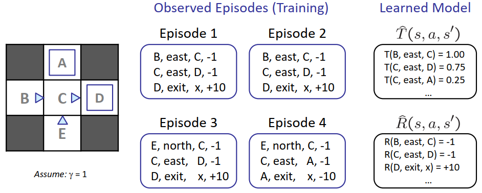

# 十一、强化学习 Reinforcement Learning

## 双老虎机案例

考虑面前有两个老虎机，分别为红色和蓝色。其中蓝色老虎机每次拉动拉杆有$P=1$的概率获得一美元，红色老虎机每次拉动拉杆有$P=0.75$的概率获得二美元，有$P=0.25$的概率获得零美元。求给定总拉动次数为$100$的情况下，获得最多美元的策略。

解决：可以通过MDP的方法进行解决，只需要提前计算而不需要真正进行老虎机的拉动。最终结论为，玩红色老虎机效用为$150$美元，蓝色老虎机效用为$100$美元。

对于该案例，假设红色老虎机获得二美元和零美元的概率是未知的，而我们仅仅能观察到拉动红色老虎机的获利，再次考虑获得美元最多的策略：

- 这是一个学习问题，而非计划问题
- **强化学习**的概念由此引出，我们需要通过采样观察得到信息，并利用这些信息来进行判断，尽管这些信息可能不准确。

相较于MDP，强化学习的转移模型$T(s,a,s')$和奖励模型$R(s,a,s')$是未知的，需要环境问题本身给出观察结果

## 根据模型的学习

核心思想：根据采样估计转移模型和奖励模型的值$\hat{T}(s,a,s'),\hat{R}(s,a,s')$

假设我们要求上海科技大学学生的期望年龄，即
$$
E[A]=\sum_aP(a)\cdot a=0.35\times 20 +...
$$
我们通过采样$[a_1,a_2,...,a_N]$，估算$\hat{P}(a)=\frac{num(a)}{N}$，进而求得$E[A]\approx\sum_a\hat{P}(a)\cdot a$

然而，对于**和模型无关的学习**，$E[A]\approx \frac{1}{N}\sum_ia_i$

## 和模型无关的学习

### 被动强化学习

核心思想：给定**固定策略$\pi(s)$**，按照该策略行动的同时，使用**直接效用估计**学习状态的效用

#### 直接效用估计

目标：在给定策略$\pi$的情况下计算每个状态的效用

步骤：

1. 根据$\pi$行动
2. 每到达一个状态，记录当前**折扣回报总和**（包括之前状态）
3. 平均这些样本

优点：易于理解，不需要$T$和$R$，最终能估计正确的均值

缺点：状态的效用并非相互独立的，每个状态都要分别学习，收敛速度慢

#### 策略评估

我们发现直接效用估计和策略评估十分相近，而策略评估考虑到了状态效用的关联性。策略评估有如下贝尔曼方程：
$$
\begin{align}
&V^\pi_{0}(s)=0\\
&V^\pi_{k+1}(s)\leftarrow\sum_{s'}T(s,\pi(s),s')[R(s,\pi(s),s')+\gamma V^\pi_k(s')]
\end{align}
$$
尽管我们不知道$T$和$R$的值，我们可以通过采样来估算
$$
\begin{align}
&sample_1=R(s,\pi(s),s^{'}_1)+\gamma V^\pi_k(s^{'}_1)\\
&sample_2=R(s,\pi(s),s^{'}_2)+\gamma V^\pi_k(s^{'}_2)\\
&...\\
&sample_n=R(s,\pi(s),s^{'}_n)+\gamma V^\pi_k(s^{'}_n)\\
\end{align}
$$

$$
V^\pi_{k+1}(s)\leftarrow \frac{1}{n}\sum_isample_i
$$

缺点：我们无法倒转时间，采取状态$s$之后的样本

#### 时序差分学习

核心想法：在每次观察后立刻学习，更新$V(s)$

- $V(s)$的采样：$sample=R(s,\pi(s),s')+\gamma V^\pi(s')$
- $V(s)$的更新：$V^\pi(s)\leftarrow (1-\alpha)V^\pi(s)+(\alpha) sample$
- 同样的更新：$V^\pi(s)\leftarrow V^\pi(s)+\alpha(sample-V^\pi(s))$

其中蕴含着**指数平均移动**的思想：

- 运行中的插值更新：$\bar{x}_n=(1-\alpha)\cdot \bar{x}_{n-1}+\alpha \cdot x_n$
  $$
  \bar{x}_n=\frac{x_n+(1-\alpha)\cdot x_{n-1}+(1-\alpha)^2\cdot x_{n-2}+...}{1+(1-\alpha)+(1-\alpha)^2+...}
  $$

- 使最近的采样更加重要
- 降低的学习率$\alpha$能够使给出收敛的平均值

时序差分学习的限制性：

- 如果想将价值转变为新的策略，即$\pi(s)=argmax_aQ(s,a)=argmax_a\sum_{s'}T(s,a,s')[R(s,a,s')+\gamma V(s')]$，$T(s,a,s')$和$R(s,a,s')$是未知的

### 主动强化学习

