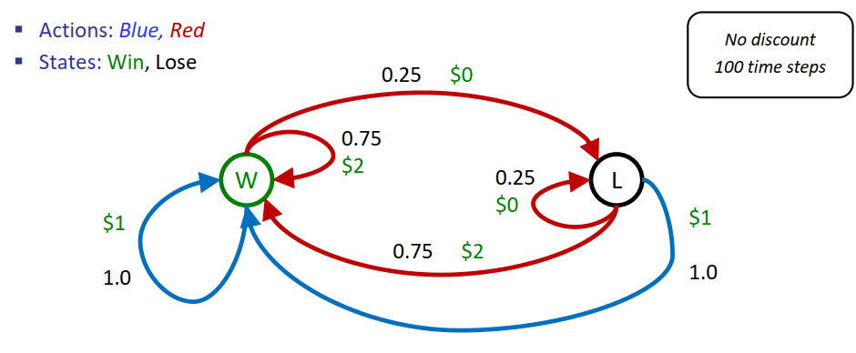
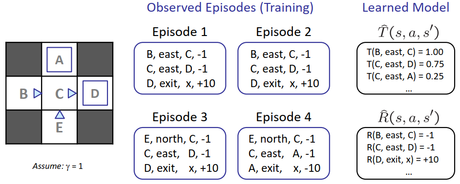
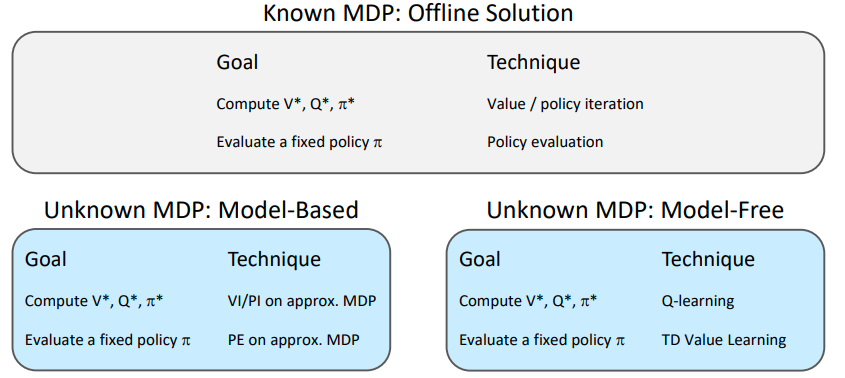
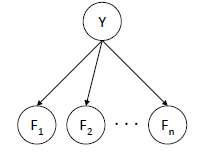
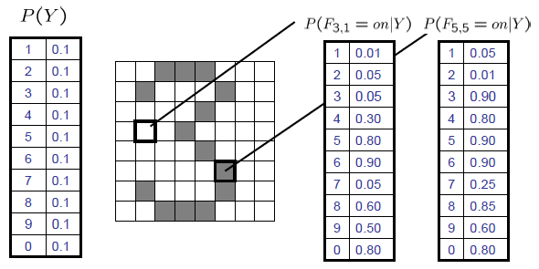
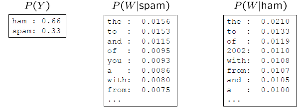
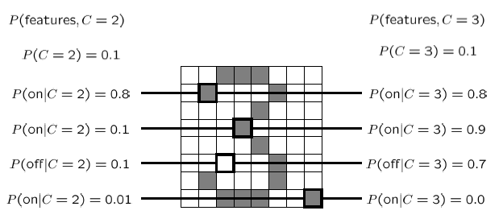

# 十一、强化学习 Reinforcement Learning

## 双老虎机案例

考虑面前有两个老虎机，分别为红色和蓝色。其中蓝色老虎机每次拉动拉杆有$P=1$的概率获得一美元，红色老虎机每次拉动拉杆有$P=0.75$的概率获得二美元，有$P=0.25$的概率获得零美元。求给定总拉动次数为$100$的情况下，获得最多美元的策略。

解决：可以通过MDP的方法进行解决，只需要提前计算而不需要真正进行老虎机的拉动。最终结论为，玩红色老虎机效用为$150$美元，蓝色老虎机效用为$100$美元。

对于该案例，假设红色老虎机获得二美元和零美元的概率是未知的，而我们仅仅能观察到拉动红色老虎机的获利，再次考虑获得美元最多的策略：

- 这是一个学习问题，而非计划问题
- **强化学习**的概念由此引出，我们需要通过采样观察得到信息，并利用这些信息来进行判断，尽管这些信息可能不准确。

相较于MDP，强化学习的转移模型$T(s,a,s')$和奖励模型$R(s,a,s')$是未知的，需要环境问题本身给出观察结果

## 根据模型的学习

核心思想：根据采样估计转移模型和奖励模型的值$\hat{T}(s,a,s'),\hat{R}(s,a,s')$

假设我们要求上海科技大学学生的期望年龄，即
$$
E[A]=\sum_aP(a)\cdot a=0.35\times 20 +...
$$
我们通过采样$[a_1,a_2,...,a_N]$，估算$\hat{P}(a)=\frac{num(a)}{N}$，进而求得$E[A]\approx\sum_a\hat{P}(a)\cdot a$

然而，对于**和模型无关的学习**，$E[A]\approx \frac{1}{N}\sum_ia_i$

## 和模型无关的学习

### 被动强化学习

核心思想：给定**固定策略$\pi(s)$**，按照该策略行动的同时，使用直接效用估计学习**状态的效用**

#### 直接效用估计

目标：在给定策略$\pi$的情况下计算每个状态的效用

步骤：

1. 根据$\pi$行动
2. 每到达一个状态，记录当前**折扣回报总和**（包括之前状态）
3. 平均这些样本

优点：易于理解，不需要$T$和$R$，最终能估计正确的均值

缺点：状态的效用并非相互独立的，每个状态都要分别学习，收敛速度慢

#### 策略评估

我们发现直接效用估计和策略评估十分相近，而策略评估考虑到了状态效用的关联性。策略评估有如下贝尔曼方程：
$$
\begin{align}
&V^\pi_{0}(s)=0\\
&V^\pi_{k+1}(s)\leftarrow\sum_{s'}T(s,\pi(s),s')[R(s,\pi(s),s')+\gamma V^\pi_k(s')]
\end{align}
$$
尽管我们不知道$T$和$R$的值，我们可以通过采样来估算
$$
\begin{align}
&sample_1=R(s,\pi(s),s^{'}_1)+\gamma V^\pi_k(s^{'}_1)\\
&sample_2=R(s,\pi(s),s^{'}_2)+\gamma V^\pi_k(s^{'}_2)\\
&...\\
&sample_n=R(s,\pi(s),s^{'}_n)+\gamma V^\pi_k(s^{'}_n)\\
\end{align}
$$

$$
V^\pi_{k+1}(s)\leftarrow \frac{1}{n}\sum_isample_i
$$

缺点：样本需要顺序采集

#### 时序差分学习

核心想法：在每次观察后立刻学习，更新$V(s)$

- $V(s)$的采样：$sample=R(s,\pi(s),s')+\gamma V^\pi(s')$
- $V(s)$的更新：$V^\pi(s)\leftarrow (1-\alpha)V^\pi(s)+(\alpha) sample$
- 同样的更新：$V^\pi(s)\leftarrow V^\pi(s)+\alpha(sample-V^\pi(s))$

其中蕴含着**指数平均移动**的思想：

- 运行中的插值更新：$\bar{x}_n=(1-\alpha)\cdot \bar{x}_{n-1}+\alpha \cdot x_n$
  $$
  \bar{x}_n=\frac{x_n+(1-\alpha)\cdot x_{n-1}+(1-\alpha)^2\cdot x_{n-2}+...}{1+(1-\alpha)+(1-\alpha)^2+...}
  $$

- 使最近的采样更加重要
- 降低的学习率$\alpha$能够使给出收敛的平均值

时序差分学习的限制性：

- 如果想将价值转变为新的策略，即$\pi(s)=argmax_aQ(s,a)=argmax_a\sum_{s'}T(s,a,s')[R(s,a,s')+\gamma V(s')]$，$T(s,a,s')$和$R(s,a,s')$是未知的

### 主动强化学习

目标：**学习最优的策略或效用**

#### Q学习 Q-Learning

- Q学习的价值迭代
  $$
  Q_{k+1}(s,a)\leftarrow \sum_{s'}T(s,a,s')[R(s,a,s')+\gamma max_{a'}Q_k(s',a')]
  $$

- 步骤：

  - 接收一个采样$(s,a,s',r)$
  - 考虑旧的估计：$Q(s,a)$
  - 考虑新的样本估计：$sample=R(s,a,s')+\gamma max_{a'}Q(s',a')$
  - 将新的估计并入运行平均值：$Q(s,a)\leftarrow (1-\alpha)Q(s,a)+(\alpha)[sample]$

特性：

- Q学习是一种与**策略无关的学习**，这意味着尽管选择不是最优的，Q学习也会收敛到最优策略

## 根据MDP和问题特性选择方法

## 探索策略选择

### $\varepsilon$贪心

制定一个概率$P=\varepsilon$：

- 有$\varepsilon$的概率随机选择方向
- 有$1-\varepsilon$的概率选择当前最优策略

同时随着时间降低$\varepsilon$的值

### 探索方程

探索那些还未被充分探索的地方，最终将停止探索

**核心思想**：通过修改Q值来选择行动

效用方程定义为：
$$
f(u,n)=u+\frac{k}{n}
$$
其中$u$为Q值的估计，$k$为一个常数，$n$为该状态访问的次数

**Q值更新**：

- 通常情况下：$Q(s,a)\leftarrow_\alpha R(s,a,s')+\gamma max_{a'}Q(s',a')$
- 修改情况下：$Q(s,a)\leftarrow_\alpha R(s,a,s')+\gamma max_{a'}f(Q(s',a'),N(s',a'))$

### 近似Q学习

标准的Q学习需要维护记录所有状态的Q值表，而通常情况状态数量过多，难以遍历或记录

想法：通过经验学习少量的训练状态，将这些经验归纳到新的、相近的状态

#### 基于特征的表述

通过一数组的特征来描述一个状态，比如对于吃豆人，可能有以下特征：

- 距离最近鬼的距离
- 距离最近豆子的距离
- 鬼的数量
- 豆子的数量
- 吃豆人是否在一个通道内被鬼包夹？

通过以上的特征描述，我们可以用权重来得到任何状态的q函数：
$$
V(s)=w_1f_1(s)+w_2f_2(s)+...+w_nf_n(s)\\
Q(s,a)=w_1f_1(s,a)+w_2f_2(s,a)+...+w_nf_n(s,a)
$$
优势：所有的经验被总结为几个强有力的数字

劣势：各个状态可能有共同的特点，但实际上在价值上有很大的不同

步骤：

- 接收一个采样$(s,a,s',r)$
- 计算**差**：$difference=[r+\gamma max_{a'}Q(s',a')]-Q(s,a)$
- 近似特征值更新：$w_i\leftarrow w_i+\alpha[difference]f_i(s,a)$

Note：通常Q值更新，$Q(s,a)\leftarrow Q(s,a)+\alpha[difference]$

关于特征值更新的解释：调整有效特征的权重，如果发生错误，对引起该错误的特征降权重

##### 相关推广

- 多项式近似Q值：$Q(s,a)=w_{11}f_1(s,a)+w_{12}f_1(s,a)^2+w_{13}f_1(s,a)^3+...$

- 神经网络：$Q(s,a)=w_1f_1(s,a)+w_2f_2(s,a)+...+w_nf_n(s,a)$，其中参数也是经由训练得到
  $$
  w_m\leftarrow w_m+\alpha[r+\gamma max_a Q(s',a')-Q(s,a)]\frac{dQ}{dw_m}(s,a)
  $$

### 策略搜索

由于基于特征的表述预测性过于强烈，可能为了使特征最大，选择当前非奖励最大的行动

想法：学习使奖励最大化的政策，而不是预测奖励的值，从一个确定的解决方案开始（例如，近似Q学习），然后微调特征权重以找到更好的政策

最简单的策略搜索步骤：从一个初始的线性Q近似开始，改变每个特征的权重，测试该策略是否更好

# 十二、监督学习

监督学习是一个被定义的过程

- 目标：学习一个未知的目标函数$f$
- 输入：含有有**标签**$(x_j,y_j),y_j=f(x_j)$的训练集
- 输出：接近$f$的假设$h$

典型问题：

- 分类问题：学习具有离散的输出值$f$
- 回归问题：学习具有实数域的输出值的$f$
- 结构化预测：学习具有结构化输出的$f$

## 分类问题

分类问题定义为给定输入$x$，预测标签（分类）$y$

### 应用举例

#### 垃圾邮件过滤器 Spam Filter

- 输入：一封电子邮件
- 输出：垃圾邮件（spam）或正常邮件（ham）

初始化：获取大量已分类的样本邮件，每封都已标记垃圾邮件或正常邮件，期望预测新的、未来的电子邮件的标签

垃圾邮件的可能特征：

- 文字：FREE!
- 文本模式：$, CAPS
- 非文本内容

#### 数字识别 Digit Recognition

- 输入：图像，像素网格
- 输出：数字0~9

初始化：获得大量的示例图像，每张图像都标有一个数字，期望预测新的、未来的数字图像的标签

可能特征：

- 某一个像素是黑色的
- 形状特征：组成部分，曲率

### 基础贝叶斯分类器

该分类器是一种基于模型的方法，建立一种标签和特征都是随机变量的贝叶斯网络，实例化任何观察到的特征，并根据特征查询标签的分布情况

$$
P(Y,F_1,...,F_n)=P(Y)\prod_iP(F_i|Y)
$$
其中$Y$为标签，$F_1,...,F_n$为特征，并且特征之间关于标签相互独立

#### 应用举例

##### 数字识别

特征为图像网格对应位置是否是开或关（二进制表示），开关定义为该像素点强度是否大于或小于$0.5$

##### 邮件过滤器

特征为$W_i$，即第$i$位置的单词。由于每个位置都是独立的，可以认为所以位置都共享条件概率$P(W|Y)$，因此模型对词序或重新排序不敏感，且这些单词集合被称为“词包”

#### 推断

目标：计算关于标签$Y$后验分布$P(Y|f_1,...,f_n)$

步骤：

1. 得到关于标签和特征的联合分布$P(Y,f_1,...,f_n)$
2. 对求得的联合分布归一化

### 测试数据集学习

对于基础贝叶斯网络，我们知道模型的结构，需要去估计概率表格（CPTs），而建立CPTs的过程需要训练数据

**经验增率**：对于每个结果$x$，$P_{ML}(x)=\frac{count(x)}{total\, samples}$。例如，我们从垃圾邮件中看到了1000个单词，其中有50是 "money"，因此设定$P(money|spam)=0.05$

Note: 该估计方法为最大似然估计（似然：给定参数数据的条件概率）

#### 最大似然估计MLE

MLE：最大似然估计是找出参数使概率最大

例如硬币问题，假设$P(heads)=\theta$，一个有着$\alpha_H$个正面和$\alpha_T$个反面的序列$D$的概率为
$$
P(D|\theta)=\theta^{\alpha_H}(1-\theta)^{\alpha_T}
$$
通过$ln$函数，可以等价为求得
$$
\begin{align}
\hat{\theta}&=arg\max_\theta\,\ln{P(D|\theta)}\\
&=arg\max_\theta\,\ln{\theta^{\alpha_H}(1-\theta)^{\alpha_T}}
\end{align}
$$
利用一阶导为零的性质，求得连续函数极值
$$
\begin{align}
\frac{d}{d\theta}\ln{P(D|\theta)}&=\frac{d}{d\theta}\ln{\theta^{\alpha_H}(1-\theta)^{\alpha_T}}\\
&=\frac{\alpha_H}{\theta}-\frac{\alpha_T}{1-\theta}=0
\end{align}
$$
最终解得
$$
\hat{\theta}_{MLE}=\frac{\alpha_H}{\alpha_H+\alpha_T}
$$

### 训练和测试

#### 重要概念

- 数据：被贴上标签的实例
  - 测试数据集
  - 保留数据集
  - 测试数据集
- 实验周期
  - 通过测试数据集学习参数
  - 在保留数据集上调整参数
  - 计算测试数据集的准确性
- 典型问题
  - 欠拟合（Underfitting）：测试集中训练效果很差
  - 过拟合（Overfitting）：测试集中训练效果很好，但测试集中效果很差

测试基线问题：需要定义一个标准，用来评估测试效果的好坏

测试基线过低的影响：给所有测试实例贴上训练集最常见的标签，如给所有过滤邮件都鉴定为正常邮件；如果测试数据集有偏差，精确度有可能会很高，如数据集中有66%的正常邮件，最终结果70%的准确率就不算好。

Note: 对于真实研究，基线通常是根据之前研究设定的

#### 泛化和过拟合

过拟合案例：如上图所述，由于右下角的像素在训练集中未出现，因此识别该数字为3的概率为零

使用经验增率会过拟合数据集，因为尽管在训练中未见到相关实例，不意味在测试集中见不到，因此不能给未见过的时间赋值为零

过拟合发生原因：

- 训练样本过少或噪声过大，导致无法得出真实数据分布
- 与分类问题无关属性过多
- 模型表达能力过强，有很强的训练集记忆能力

#### 过拟合的平滑

##### 拉普拉斯平滑 Laplace Smoothing

想法：假设看到的每个结果都比实际情况多一次
$$
\begin{align}
P_{LAP}(x)&=\frac{c(x)+1}{\sum_x{c(x)+1}}\\
&=\frac{c(x)+1}{N+|X|}
\end{align}
$$

##### 拉普拉斯估计扩展

想法：假设看到的每个结果都比实际情况多$k$次
$$
P_{LAP,k}(x)=\frac{c(x)+k}{N+k|X|}
$$

##### 条件拉普拉斯估计

前提：需要每个$x$条件独立
$$
P_{LAP,k}(x|y)=\frac{c(x,y)+k}{c(y)+k|X|}
$$

Note: 经验增率是最大似然估计；拉普拉斯估计是最大可能参数估计

##### 线性插值 Linear Interpolation

当$|X|,|Y|$分别较大的情况时，拉普拉斯对$P(X|Y)$估计较差

线性插值想法：从数据中得到经验率$P(X)$，保证估计$P(X|Y)$和$P(X)$相差不大
$$
P_{LIN}(x|y)=\alpha \hat{P}(x|y)+(1-\alpha)\hat{P}(x)
$$

### 保留数据集超参数调整

通过在测试集上的学习，我们得出以下两种参数：

- 普通参数：$P(X|Y),P(Y)$
- 超参数：$k$（拉普拉斯估计），$\alpha$（线性插值）

普通参数是根据训练集得出的，而超参数需要在保留数据集上不断调试，直到找到表现最好的超参数

### 线性分类器

- 输入：特征值
- 权重：每个特征值有一个权重
- **激活**：加权特征和
- 输出：根据激活和问题类型决定，如二元分类器，当激活值为负数输出$-1$，为正数输出$1$

$$
activation_w(x)=\sum_i w_i\cdot f_i(x)=w\cdot f(x)
$$

有时在激活的计算会假如一个偏差（bias）
$$
\sum_i w_i\cdot f_i(x)+b=w\cdot f(x)+b
$$
Note: 偏差等价于加入一个常量特征

